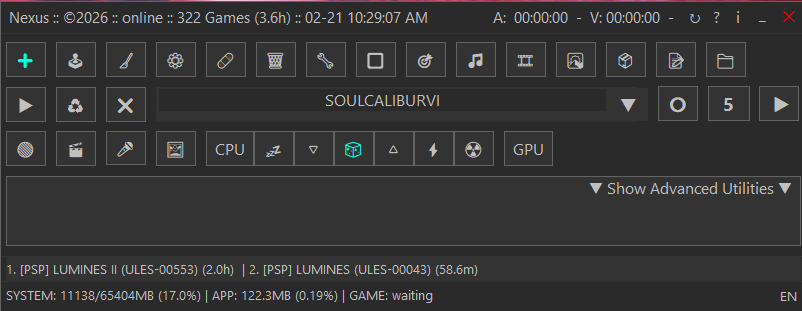

[](https://www.gnu.org/licenses/gpl-3.0)

---

# Nexus (Nexus)


#### The app was created to get a perfect borderless full screen view when running a game and also to make it easy switching a game window between 2 monitors.

### Summary of the NEXUS Logic:
* **Boot**: Nexus.ahk calls ConfigManager.Init().
* **Memory**: nexus.json is parsed into a high-speed Map in RAM.
* **UI**: GuiBuilder asks ConfigManager for the list and displays it instantly.
* **Launch**: When you click Start, StartGame() gets the full game object from RAM (including IsPatchable: true).
* **Patch**: If patchable, the PatchService handles this.

### In Windows: Preferred Settings:
* Set display settings for both monitors at 100%.
* Set resolution for both monitors to 1920x1080.
* Set the refresh rate on both monitors to 60Hz.        
  **Audio mic settings Windows:**
* Press Windows + R and enter:  mmsys.cpl
* Right click: Speakers/properties.
* Go to **Levels** tab and change the second row **Microphone** **level** to **100**.

### Voice Commands Hotkeys
If you start the app a mic icon will appear in your system tray, that indicates voice commands can be used.
* F8 = Voice listening toggle.
* F9 = Language cycle.
* Ctrl+F10 = Voice keyword catalog debug on/off.
  If whisper is enabled.
* Tap F8 → mic icon turns orange, status bar shows "Listening..."
* Whisper records 2 seconds of audio via whisper_db_once.py
* Transcript goes through the same routing logic as before (DB mode, command matching, aliases, close intent — all unchanged)
* Mic icon resets to grey, status bar shows what was heard (or "Ready")

### Voice Commands List
* start: start, go, launch, start game, 开始, 開始, avvia, iniciar, demarrer, demarrer, старт, запуск, запусти, начать, поехали
* restart: restart, reset, reload, relaunch, retry, 重启, 再起動, riavvia, reiniciar, redemarrer, redemarrer, перезапуск, перезапусти, рестарт, сброс
* exit: exit, quit, end, stop, terminate, 退出, 終了, esci, salir, quitter, выход, выити, закрыть, стоп, завершить
* help: help, assist, manual, support, question, question mark, help me, halp, elder, helped, helpful, helping, health, held, hill, 帮助, ヘルプ, aiuto, ayuda, aide, помощь, справка, подсказка
* browser: browser, explorer, 浏览器, ブラウザ, esplora, navegador, navigateur, браузер, проводник
* database: database, db, library, data, 数据库, 资料库, 数据, データベース, でーたべーす, archivio, dati, bancadati, banca dati, basedatos, base de datos, datos, biblioteca, base, base de donnees, base de donnees, donnees, donnees, bdd, база, база данных, бд, данные, библиотека
* gallery: gallery, photos, 画廊, ギャラリー, galleria, galeria, galeria, galerie, галерея, фото
* snapshot: snapshot, snap, photo, capture, 截图, 快照, スナップ, istantanea, captura, снимок, скриншот, скрин
* focus: focus, refocus, 聚焦, フォーカス, foco, фокус
* music: music, song, 音乐, 音楽, musica, musica, musique, музыка, песня
* video: video, movie, 视频, ビデオ, film, фильм

### Special Behavior
#### In Music window:
* play,
* stop,
* fullscreen, full screen are handled directly.
#### In Database window:
* saying a query performs search;
* close intent words like close, quit, exit, stop, fermer, chiudi, cerrar, закрыть, выити close DB.
#### Optional DB search prefixes:
* search, find, lookup, look up, buscar, recherche, chercher, cerca, ricerca, 搜索, 搜, 查找, 検索, искать, поиск, наити.
#### Others
* burst aliases exist in catalog (rapid, 连拍, 連写, raffica, rafaga, rafale, серия, очередь) but are not active right now because no burst callback is registered in

### Game settings:
* If in-game display settings are available use borderless (preferred). See examples in the media folder.

_Note: some games launch differently they have their own dedicated screen manager app._

### Collecting statistics data
Number of games, play time, total played time and top3 played data are collected to be able to show them in the main UI. Basic system info is collected. Personal data is never collected. Data is only stored locally within the users app environment.

### Nexus Main Gui


#### Basic Instructions:
Place Nexus in a central location.

### Features
* Language switcher on the bottom right. Most text is translated in Chinese, Japanese, Italian, Spanish, French and Russian.
* Two modes, icon mode (default) and text mode. Double-click in the top status bar to switch between the modes.
* Voice commands, press F8 to start voice commands, you can say for instance 'start' and the current selected game will start. If you say 'exit' the game wil be closed. Voice commands are also translated.
* Connect a DualShock 4 controller with DS4 Windows and you can take a snapshot with the Share button.
* In the music player Right Click oin a track will show you some extra options.
* Music Player in fullscreen will start special effects.
* And a lot more hidden features throughout the app.

### Game Window Features:
* Window management.
* True borderless fullscreen window.
* Fit screen.
* Reposition the game window.
* Easy move window between monitors.

### Game Features:
* Run all games, .iso. .cso, pbp, eboot.bin, .bat, .xml, .exe.
* Run RPCS3 games direct in fullscreen mode skipping the frontend.
* Run PCSX2 games direct in fullscreen mode skipping the frontend.
* Run PPSSPP games direct in fullscreen mode skipping the frontend.
* Run DuckStation games direct in fullscreen mode skipping the frontend.
* Run games that only run through a .bat file.
* Autodetect TeknoParrot game profiles and run the game in fullscreen.
* Manage emulator profiles.
* Patch EBOOT.BIN and clone game.
* Run Arcade games that need special versions of RPCS3.
* Save games for quick re-run.

### Process:
* Change CPU process priority.
* RAM usage overview, system, app and game.
* Optional GPU overclock with Afterburner

### Media:
* Take snapshots + burst snapshots (max. 99).
* Audio recording.
* Music player (uses legacy Windows Media Player).
* Video capture.
* Video player (loads external player).
* Image viewer.
* And more...

### Phantom Windows, JConfig, Settings
With the combination of positioning and resizing you can achieve a perfect full screen window.                                                  
Check the settings folder for some of the (JConfig) screen settings that gave me the basis for a perfect screen.                                           
Some games have phantom windows (sometimes more than one, good examples are Dead or Alive 5 and Tekken 7).
"Manage All Windows" shows an overview of windows which can be managed.

---

### Capture Audio or Video (with sound)

I used some additional tools for this:
* Voicemeeter Banana: [voicemeeter](https://vb-audio.com/Voicemeeter/potato.htm)
* Vgmstream: [vgmstream](https://vgmstream.org/)
* Ffmpeg: [ffmpeg](https://www.gyan.dev/ffmpeg/builds/ffmpeg-git-full.7z")

### Other tools used
* SoundVolumeView: [SoundVolumeView](https://www.nirsoft.net/utils/sound_volume_view.html)

Voicemeeter makes it possible to reroute your audio streams so you can listen to the audio that is being recorded.   
In Voicemeeter Basic, FFmpeg must record a B-bus (B1/B2/B3), and audio only reaches that bus if you explicitly enable it on the Virtual Input strip.
That's why I prefer Voicemeeter Banana.

## My Settings for Voicemeeter Banana:

#### Hardware Out
* A1: Mi TV -2 (Intel(R) Display Audio) - This is sound from my 2nd monitor (a TV) connected with my laptop through HDMI.
* A2: Speakers (Realtek High Definition Audio) - Laptop sound.
* A3: Headset Microphone (3- Wireless Controller)

#### Virtual Input
* Voicemeeter Input (left column): A1 - B1
* Here you control your output by selecting A1, A2 or A3. A1 is TV, A2 is Speakers and A3 is Headset.
* Voicemeeter AUX (right column): A1 - B1

#### Windows Sound Settings
In Windows Go to Settings/System/Sound and set this:
* Output: Voicemeeter AUX Input
* Input: Voicemeeter Out B1

#### Example of Audio Devices on your System
* Mi TV -2 (Intel(R) Display Audio)
* Microphone (Realtek High Definition Audio)
* Speakers (Realtek High Definition Audio)
* Headset Microphone (Wireless Controller)
* Voicemeeter Out B1 (VB-Audio Voicemeeter VAIO) = Default Input.
* Voicemeeter Out B2 (VB-Audio Voicemeeter VAIO)
* Voicemeeter Out B3 (VB-Audio Voicemeeter VAIO)
* Voicemeeter Out A3 (VB-Audio Voicemeeter VAIO)
* Voicemeeter Out A4 (VB-Audio Voicemeeter VAIO)
* Voicemeeter Out A2 (VB-Audio Voicemeeter VAIO)
* Voicemeeter Out A5 (VB-Audio Voicemeeter VAIO)
* Voicemeeter Out A1 (VB-Audio Voicemeeter VAIO)


### List all Audio Devices
Run this from within the folder where ffmpeg is located.
```powershell
./ffmpeg -list_devices true -f dshow -i dummy
```

### Overclock GPU
For use in this app, MSI Afterburner is used: [MSI Afterburner](https://www.msi.com/Landing/afterburner/graphics-cards)

### Namco 357 + 369 game id's
In advanced utilities the Clone Wizard can be used to change the game id's, usefully because all Namco games use the same game id `SCEEXE000`

| Game                                                        | Year     | Namco System   | Compatible with RPCS3 (MD5) | Firmware                | Location | Original ID | Custom ID |
|-------------------------------------------------------------|----------|:---------------|:----------------------------|:------------------------|:---------|-------------|-----------|
| **Tekken 6**                                                | **2007** | **System 357** |                             | **Arcade FW 2.51**      |          |             |           |
| **Tekken 6: Bloodline Rebellion**                           | **2008** | **System 357** |                             | **Arcade FW 2.51**      |          |             |           |
| **Razing Storm**                                            | **2009** | **System 357** |                             | **Arcade FW 2.51**      |          |             |           |
| **Mobile Suit Gundam: Extreme Vs.**                         | **2010** | **System 357** |                             | **Arcade FW 2.51**      |          |             |           |
| **Deadstorm Pirates**                                       | **2010** | **System 357** |                             | **Arcade FW 2.51**      |          |             |           |
| **Tekken Tag Tournament 2**                                 | **2011** | **System 369** |                             | **Arcade FW 3.30–3.41** |          |             |           |
| **Dragon Ball ZENKAI Battle Royale**                        | **2011** | **System 357** |                             | **Arcade FW 2.51**      |          |             |           |
| **Taiko no Tatsujin (2011 arcade)**                         | **2011** | **System 357** |                             | **Arcade FW 2.51**      |          |             |           |
| **Tekken Tag Tournament 2 Unlimited**                       | **2012** | **System 369** |                             | **Arcade FW 3.41–3.55** |          |             |           |
| **Dragon Ball ZENKAI Battle Royale Super Saiyan Awakening** | **2012** | **System 357** |                             | **Arcade FW 2.51**      |          |             |           |
| **Mobile Suit Gundam: Extreme Vs. Full Boost**              | **2012** | **System 357** |                             | **Arcade FW 2.51**      |          |             |           |
| **Dark Escape 3D**                                          | **2012** | **System 369** |                             | **Arcade FW 3.30+**     |          |             |           |
| **Taiko no Tatsujin KATSU-DON**                             | **2012** | **System 357** |                             | **Arcade FW 2.51**      |          |             |           |
| **Taiko no Tatsujin Sorairo ver.**                          | **2013** | **System 369** |                             | **Arcade FW 3.41+**     |          |             |           |
| **Taiko no Tatsujin Momoiro ver.**                          | **2013** | **System 369** |                             | **Arcade FW 3.41+**     |          |             |           |
| **Mobile Suit Gundam: Extreme Vs. Maxi Boost**              | **2014** | **System 369** |                             | **Arcade FW 3.55**      |          |             |           |
| **Deadstorm Pirates Special Edition**                       | **2014** | **System 369** |                             | **Arcade FW 3.41–3.55** |          |             |           |
| **Dark Escape 4D**                                          | **2014** | **System 369** |                             | **Arcade FW 3.55**      |          |             |           |
| **Taiko no Tatsujin Kimidori ver.**                         | **2014** | **System 369** |                             | **Arcade FW 3.55**      |          |             |           |
| **Taiko no Tatsujin Murasaki ver.**                         | **2015** | **System 369** |                             | **Arcade FW 3.55**      |          |             |           |
| **Taiko no Tatsujin White ver.**                            | **2015** | **System 369** |                             | **Arcade FW 3.55**      |          |             |           |
| **Taiko no Tatsujin Red ver.**                              | **2016** | **System 369** |                             | **Arcade FW 3.55**      |          |             |           |
| **Taiko no Tatsujin Yellow ver.**                           | **2017** | **System 369** |                             | **Arcade FW 3.55**      |          |             |           |
| **Taiko no Tatsujin Blue ver.**                             | **2018** | **System 369** |                             | **Arcade FW 3.55**      |          |             |           |
| **Taiko no Tatsujin Green ver.**                            | **2019** | **System 369** |                             | **Arcade FW 3.55**      |          |             |           |

---


                
**RobertoTorino**


