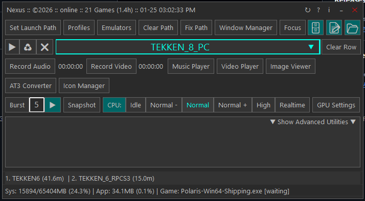

# Nexus (Nexus)


#### The app was created to get a perfect fitting full screen when running a game and to make it easy switching a game window between monitor 1 and monitor 2.                    


## Summary of the NEXUS logic:
* Boot: Nexus.ahk calls ConfigManager.Init().
* Memory: nexus.json is parsed into a high-speed Map in RAM.
* UI: GuiBuilder asks ConfigManager for the list and displays it instantly.
* Launch: When you click Start, StartGame() gets the full game object from RAM (including IsPatchable: true).
* Patch: If patchable, the PatchService handles the VER.206 files.


**In Windows:**                 
* Display settings for both monitors should be at 100%.                      
* Resolution should be set to 1920x1080.                     
* Make sure the refresh rate on both monitors is equal, for instance 60Hz.            

**Game settings:**              
If in-game display settings are available use borderless (preferred). See examples in the media folder.                     

_Note: some games launch differently they have their own dedicated screen manager app._

### Nexus Main Gui


#### Basic instructions:
Place Nexus in a central location.

## Game window features:
* Window management.
* True borderless fullscreen window.
* Reposition the game window.
* Easy move window between monitors.

Game Features:
* Run all games, .iso. .cso, pbp, eboot.bin, .bat, .xml, .exe.
* Run RPCS3 games direct in fullscreen mode skipping the frontend.
* Run PCSX2 games direct in fullscreen mode skipping the frontend.
* Run PPSSPP games direct in fullscreen mode skipping the frontend.
* Run DuckStation games direct in fullscreen mode skipping the frontend.
* Run games that only run through a .bat file.
* Autodetect TeknoParrot game profiles and run the game in fullscreen.
* Manage emulator profiles.
* Patch EBOOT.BIN and clone game.
* Run Arcade games that need special versions of RPCS3.
* Save games for quick re-run.

Process:
* Change CPU process priority.
* RAM usage overview, system, app and game.
* GPU overclock with Afterburner

Media:
* Take snapshots + burst snapshots (max. 99).
* Audio recording.
* Music player (uses legacy Windows Media Player).
* Video capture.
* Video player (loads external player).
* Image viewer.
* And more...


**Phantom windows, JConfig, Settings**                    
With the combination of positioning and resizing you can achieve a perfect full screen window.                                                  
Check the settings folder for some of the (JConfig) screen settings that gave me the basis for a perfect screen.                                           
Some games have phantom windows (sometimes more than one, good examples are Dead or Alive 5 and Tekken 7).
"Manage All Windows" shows an overview which can be managed.  

Other sizes available for test purposes, examples:                    

| #   | Name                    | Screen Resolution | Browser Viewport     | 
|-----|-------------------------|-------------------|----------------------|
| 1️⃣ | **Full HD (FHD)**       | **1920 × 1080**   | **≈ 1536 × 754 px**  | 
| 2️⃣ | **Quad HD (QHD / 2K)**  | **2560 × 1440**   | **≈ 2304 × 1216 px** | 
| 3️⃣ | **4K Ultra HD (UHD)**   | **3840 × 2160**   | **≈ 3200 × 1728 px** | 
| 4️⃣ | **5K**                  | **5120 × 2880**   | **≈ 4480 × 2592 px** | 
| 5️⃣ | **6K**                  | **6016 × 3384**   | **≈ 5376 × 3096 px** | 
| 6️⃣ | **8K Ultra HD (UHD-2)** | **7680 × 4320**   | **≈ 7040 × 4032 px** | 


## Common Window Modes (High-Level, User-Facing)

| #   | Mode           | Description                                                                        | Notes                                  |
|-----|----------------|------------------------------------------------------------------------------------|----------------------------------------|
| 1️⃣ | **Fullscreen** | **Covers the entire screen, often exclusive mode for games.**                      | **Usually removes borders/title bar.** |
| 2️⃣ | **Windowed**   | **Standard resizable window with title bar and borders.**                          | **Can be moved, resized.**             |
| 3️⃣ | **Borderless** | **Windowed Fullscreen	Looks fullscreen but technically a window without borders.** | **Easier alt-tabbing.**                |
| 4️⃣ | **Hidden**     | **Window exists but is invisible.**                                                | **Uses SW_HIDE.**                      |


## Window States (WinAPI / How Windows Manages Visibility)

| #   | State                 | WinAPI constant                             | Description                                         |
|-----|-----------------------|---------------------------------------------|-----------------------------------------------------|
| 1️⃣ | **Normal / Restored** | **SW_SHOWNORMAL / SW_RESTORE**              | **Standard window size, not minimized/maximized.**  |
| 2️⃣ | **Minimized**         | **SW_MINIMIZE**                             | **Shrunk to taskbar; can still receive messages.**  |
| 3️⃣ | **Maximized**         | **SW_SHOWMAXIMIZED**                        | **Easier alt-tabbing.**                             |
| 4️⃣ | **Hidden**            | **SW_HIDE**                                 | **Window exists but invisible.**                    |
| 5️⃣ | **Shown / Activated** | **SW_SHOW / SW_SHOWNA / SW_SHOWNOACTIVATE** | **Fills the screen but retains borders/title bar.** | 


## Window Styles (Fine-Grained Appearance / Behavior)

| #   | Style                          | Description                                                           |
|-----|--------------------------------|-----------------------------------------------------------------------|
| 1️⃣ | **WS_OVERLAPPEDWINDOW**        | **Typical app window: border, title bar, minimize/maximize buttons.** |
| 2️⃣ | **WS_POPUP**                   | **Borderless window, often used for fullscreen.**                     |
| 3️⃣ | **WS_BORDER**                  | **Thin border around the window.**                                    |
| 4️⃣ | **WS_CAPTION**                 | **Adds title bar.**                                                   |
| 5️⃣ | **WS_SYSMENU**                 | **Adds system menu (icon, close button).**                            |
| 6️⃣ | **WS_MINIMIZEBOX**             | **Adds minimize/maximize buttons.**                                   |
| 7️⃣ | **WS_SIZEBOX / WS_THICKFRAME** | **Allows resizing by dragging edges.**                                |
| 8️⃣ | **WS_DISABLED**                | **Window cannot receive input.**                                      |
| 9️⃣ | **WS_VISIBLE**                 | **Initially visible.**                                                |

These styles can be combined to achieve modes like “borderless windowed” or “fullscreen windowed.”


## Extended Window Styles (Extra Options)

| #   | Style                | Description                                                   | 
|-----|----------------------|---------------------------------------------------------------|
| 1️⃣ | **WS_EX_TOPMOST**    | **Covers the entire screen, often exclusive mode for games.** |
| 2️⃣ | **WS_EX_TOOLWINDOW** | **Small title bar, often used for floating tool windows.**    | 
| 3️⃣ | **WS_EX_APPWINDOW**  | **Forces a window to appear in the taskbar.**                 |
| 4️⃣ | **WS_EX_NOACTIVATE** | **Window shows without stealing focus.**                      |
| 5️⃣ | **WS_EX_LAYERED**    | **Allows transparency and alpha blending.**                   |


---

## Capture audio

We need some additional tools for this:                 
* Voicemeeter Banana: [voicemeeter](https://vb-audio.com/Voicemeeter/potato.htm)
* Vgmstream: [vgmstream](https://vgmstream.org/)
* Ffmpeg: [ffmpeg](https://www.gyan.dev/ffmpeg/builds/ffmpeg-git-full.7z")

### Other tools used
* SoundVolumeView: [SoundVolumeView](https://www.nirsoft.net/utils/sound_volume_view.html)

Voicemeeter makes it possible to reroute your audio streams so you can listen to the audio that is being recorded.   
In Voicemeeter Basic, FFmpeg must record a B-bus (B1/B2/B3), and audio only reaches that bus if you explicitly enable it on the Virtual Input strip.
That's why I prefer Voicemeeter Banana.
My settings for Voicemeeter Banana:

#### Hardware Out
* A1: Mi TV -2 (Intel(R) Display Audio) - This is sound from my 2nd monitor (a TV) connected with my laptop through HDMI.
* A2: Speakers (Realtek High Definition Audio) - Laptop sound.
* A3: Headset Microphone (3- Wireless Controller)

#### Virtual Input
* Voicemeeter Input (left column): A1 - B1 
* Here you control your output by selecting A1, A2 or A3. A1 is TV, A2 is Speakers and A3 is Headset.
* Voicemeeter AUX (right column): A1 - B1

#### Windows Sound Settings
In Windows Go to Settings/System/Sound and set this:              
* Output: Voicemeeter Input
* Input: Voicemeeter Out B1

#### Example of My Audio devices
* Mi TV -2 (Intel(R) Display Audio)
* Microphone (Realtek High Definition Audio)
* Speakers (Realtek High Definition Audio)
* Headset Microphone (Wireless Controller)
* Voicemeeter Out B1 (VB-Audio Voicemeeter VAIO) = Default Input.   
* Voicemeeter Out B2 (VB-Audio Voicemeeter VAIO)
* Voicemeeter Out B3 (VB-Audio Voicemeeter VAIO)
* Voicemeeter Out A3 (VB-Audio Voicemeeter VAIO)
* Voicemeeter Out A4 (VB-Audio Voicemeeter VAIO)
* Voicemeeter Out A2 (VB-Audio Voicemeeter VAIO)
* Voicemeeter Out A5 (VB-Audio Voicemeeter VAIO)
* Voicemeeter Out A1 (VB-Audio Voicemeeter VAIO)


### List all audio devices
```powershell
./ffmpeg -list_devices true -f dshow -i dummy
```

## Overclock GPU
For use in this app MSI Afterburner is used: [MSI Afterburner](https://www.msi.com/Landing/afterburner/graphics-cards)      

## Game ID's

| Game         | Year          | Namco System       | Compatible with RPCS3 (MD5)          | Firmware           | Location         | Original ID   | Custom ID     | 
|--------------|---------------|:-------------------|:-------------------------------------|:-------------------|:-----------------|---------------|---------------|
| **All**      | **2007-2012** | **System 357/369** | **18d4b31ada27856388c7ee9afd1172db** |                    |                  | **SCEEXE001** |               |
| **Tekken 6** | **2007**      | **System 357**     | **18d4b31ada27856388c7ee9afd1172db** | **Arcade FW 2.51** | `dev_hdd0\game\` | **SCEEXE001** | **SCEEXE001** |
| **Tekken 6** | **2007**      | **System 357**     | **18d4b31ada27856388c7ee9afd1172db** |                    | `dev_hdd0\game\` | **SCEEXE001** | **SCEEXE001** | 


3.1. SYSTEM 357
Tekken 6 (2007)
Tekken 6 BR (2008)
Time Crisis: Raging Storm (2009)
Deadstorm Pirates (2010)
Mobile Suit Gundam EXTREME VS ~ Mobile Suit Gundam EXTREME VS MAXI BOOST ON
Ancient Master Shin Moo -in ~ Blue (2011)
Dark Escape (2012)
3.2. SYSTEM 369
Tekken Tag Tournament 2 (2011)
Tekken Tag Tournament 2 Unlimited (2012)


## Custom Firmware
CEX (Customer/Retail Firmware): This is the standard, official firmware type for consumer PS3s, focused on regular game playing and features.
DEX (Developer Firmware): The firmware used on actual PlayStation 3 development kits, containing extra debugging tools and features.
PEX (PS3 Exploitable/Hybrid): PEX is a CEX firmware that includes developer modules (DEX kernel) and tools directly in the XMB, letting retail users access DEX features without fully converting.
D-PEX: The DEX equivalent of PEX, for systems already on DEX firmware.

For most users PEX is ideal as it gives you a retail (CEX) base with powerful DEX features built-in via the toolbox.
If you're already on a DEX system: D-PEX.
If you only want the pure, unmodified retail experience: CEX.


SCEEXE000=SCEEXE000
SCEEXE001=TEKKEN_6_2007
SCEEXE002=TEKKEN_6_BR_CN
SCEEXE003=TEKKEN_6_BR_JP
SCEEXE004=TEKKEN_TAG_TOURNAMENT_2
SCEEXE005=TEKKEN_TAG_TOURNAMENT_2_UNLIMITED
SCEEXE006=DRAGON_BALL_ZENKAI_BATTLE_ROYALE
SCEEXE007=TEKKEN_6_BR_CN_II


---
dev_hdd0\game\SCEEXE001


                
**RobertoTorino**      

