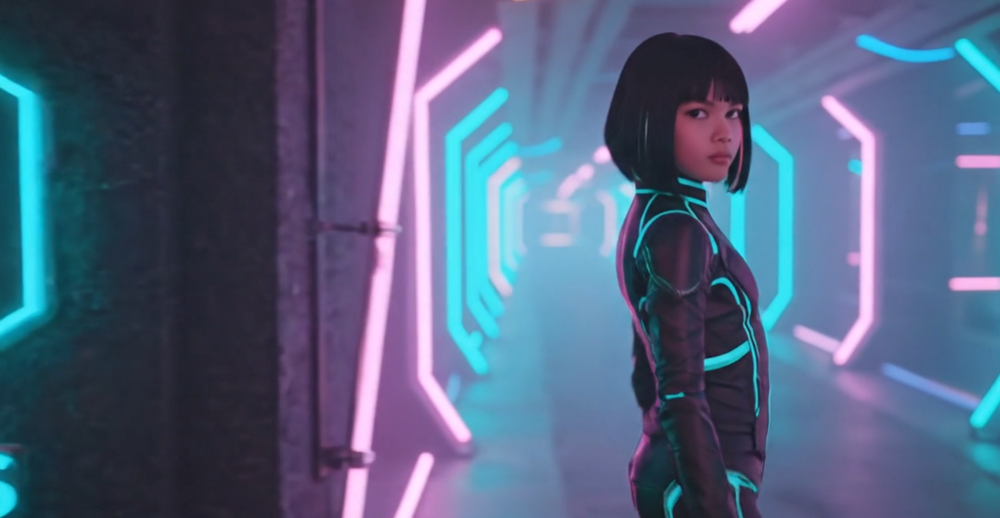

# Nexus Developers (Nexus)


### NEXUS Logic
* **Boot**: Nexus.ahk calls ConfigManager.Init().
* **Memory**: nexus.json is parsed into a high-speed Map in RAM.
* **UI**: GuiBuilder asks ConfigManager for the list and displays it instantly.
* **Launch**: When you click Start, StartGame() gets the full game object from RAM (including IsPatchable: true).
* **Patch**: If patchable, the PatchService handles this.


### Voice Commands

F8 pressed (Whisper mode)
│
▼
TriggerWhisperCmd()
├─ writes A_Temp\nexus_vc_<tick>.txt as target
└─ Run: python whisper_db_once.py --seconds 2 --model tiny
(records mic, transcribes, prints text to stdout)
│   stdout is redirected to temp file by Run() flags
▼
_PollWhisperCmd()   ← 200ms SetTimer
├─ ProcessExist(_whisperPid)?  → keep waiting
├─ timeout (_WhisperTimeoutMs)?  → abort
└─ process gone  → FileRead(temp file)
│
▼
_DispatchText(transcript, heardRaw, 1.0)
├─ debounce check (800ms)
├─ closeIntent check (firstWord in closeWords || aliasMap = "exit")
├─ dbActionBlock  (suppress single-word open/play/launch etc.)
├─ command catalog match  → Execute()
└─ DB search mode?  → DBGui search bar

SAPI (when in S mode) stays wired exactly as before — the recognizer fires Recognition() which also calls _DispatchText() with the same routing — so both paths share identical dispatch logic.Main Commands


### Window settings

Predefined sizes available in the app mainly for testing purposes:

| #   | Name                    | Screen Resolution | Browser Viewport     | 
|-----|-------------------------|-------------------|----------------------|
| 1️⃣ | **Full HD (FHD)**       | **1920 × 1080**   | **≈ 1536 × 754 px**  | 
| 2️⃣ | **Quad HD (QHD / 2K)**  | **2560 × 1440**   | **≈ 2304 × 1216 px** | 
| 3️⃣ | **4K Ultra HD (UHD)**   | **3840 × 2160**   | **≈ 3200 × 1728 px** | 
| 4️⃣ | **5K**                  | **5120 × 2880**   | **≈ 4480 × 2592 px** | 
| 5️⃣ | **6K**                  | **6016 × 3384**   | **≈ 5376 × 3096 px** | 
| 6️⃣ | **8K Ultra HD (UHD-2)** | **7680 × 4320**   | **≈ 7040 × 4032 px** | 


### Common Window Modes (High-Level, User-Facing)

| #   | Mode           | Description                                                                        | Notes                                  |
|-----|----------------|------------------------------------------------------------------------------------|----------------------------------------|
| 1️⃣ | **Fullscreen** | **Covers the entire screen, often exclusive mode for games.**                      | **Usually removes borders/title bar.** |
| 2️⃣ | **Windowed**   | **Standard resizable window with title bar and borders.**                          | **Can be moved, resized.**             |
| 3️⃣ | **Borderless** | **Windowed Fullscreen	Looks fullscreen but technically a window without borders.** | **Easier alt-tabbing.**                |
| 4️⃣ | **Hidden**     | **Window exists but is invisible.**                                                | **Uses SW_HIDE.**                      |


### Window States (WinAPI / How Windows Manages Visibility)

| #   | State                 | WinAPI constant                             | Description                                         |
|-----|-----------------------|---------------------------------------------|-----------------------------------------------------|
| 1️⃣ | **Normal / Restored** | **SW_SHOWNORMAL / SW_RESTORE**              | **Standard window size, not minimized/maximized.**  |
| 2️⃣ | **Minimized**         | **SW_MINIMIZE**                             | **Shrunk to taskbar; can still receive messages.**  |
| 3️⃣ | **Maximized**         | **SW_SHOWMAXIMIZED**                        | **Easier alt-tabbing.**                             |
| 4️⃣ | **Hidden**            | **SW_HIDE**                                 | **Window exists but invisible.**                    |
| 5️⃣ | **Shown / Activated** | **SW_SHOW / SW_SHOWNA / SW_SHOWNOACTIVATE** | **Fills the screen but retains borders/title bar.** | 


### Window Styles (Fine-Grained Appearance / Behavior)

| #   | Style                          | Description                                                           |
|-----|--------------------------------|-----------------------------------------------------------------------|
| 1️⃣ | **WS_OVERLAPPEDWINDOW**        | **Typical app window: border, title bar, minimize/maximize buttons.** |
| 2️⃣ | **WS_POPUP**                   | **Borderless window, often used for fullscreen.**                     |
| 3️⃣ | **WS_BORDER**                  | **Thin border around the window.**                                    |
| 4️⃣ | **WS_CAPTION**                 | **Adds title bar.**                                                   |
| 5️⃣ | **WS_SYSMENU**                 | **Adds system menu (icon, close button).**                            |
| 6️⃣ | **WS_MINIMIZEBOX**             | **Adds minimize/maximize buttons.**                                   |
| 7️⃣ | **WS_SIZEBOX / WS_THICKFRAME** | **Allows resizing by dragging edges.**                                |
| 8️⃣ | **WS_DISABLED**                | **Window cannot receive input.**                                      |
| 9️⃣ | **WS_VISIBLE**                 | **Initially visible.**                                                |

These styles can be combined to achieve modes like “borderless windowed” or “fullscreen windowed.”


### Extended Window Styles (Extra Options)

| #   | Style                | Description                                                   | 
|-----|----------------------|---------------------------------------------------------------|
| 1️⃣ | **WS_EX_TOPMOST**    | **Covers the entire screen, often exclusive mode for games.** |
| 2️⃣ | **WS_EX_TOOLWINDOW** | **Small title bar, often used for floating tool windows.**    | 
| 3️⃣ | **WS_EX_APPWINDOW**  | **Forces a window to appear in the taskbar.**                 |
| 4️⃣ | **WS_EX_NOACTIVATE** | **Window shows without stealing focus.**                      |
| 5️⃣ | **WS_EX_LAYERED**    | **Allows transparency and alpha blending.**                   |


---

### Screen Geometry and Overscan
Here is an example assuming you are on a 1920x1080 monitor: the width and X-Axis (horizontal): when you apply 200px of horizontal overscan: WinW (2120): This is 1920 monitor Width + 200 overscan. WinX (-100): To keep the image centered, The script pushes the window left by half of the overscan. 0 - (200 / 2) = -100. This hides 100 pixels off the left edge and 100 pixels off the right edge.

The height and Y-Axis (vertical). This is where your manual "down" nudge and the vertical overscan combine: WinH (1280): this is 1080 monitor height + 200 overscan. WinY (-80): Initially, applying 200px vertical overscan moves the Y to -100 (0 - (200 / 2)) to center it. You then nudged the window down by 20px -100 Initial Y + 20 nudge = -80.
```
Property,Base (1080p),overscan (+200),nudge (+20),
Width,1920,+200,0,2120
height,1080,+200,0,1280
X Pos,0,-100 (centered),0,-100
Y Pos,0,-100 (centered),+20 (down),-80
```


### Patch Logic example
**Example using Tekken 6 Arcade**
The PatchServiceTool.ahk code detects the game: it looks for EBOOT.BIN (or the folder structure).
It checks the current state: It calculates the CRC32 (Hash) of the VER.206 file currently in the game folder to see if you are in "Test Mode", "Normal Mode", or "Unknown".
It swaps the file: When you click the button in the popup, it copies the specific VER.206 from your patches/t6br folder and overwrites the one in the game folder.
Launch: When you click Run/Play on the main UI, the emulator (RPCS3) launches the game. Since the file is already physically swapped on the disk, the game loads into the mode you selected.
You do not need a separate launcher. The "Patch" button acts as your mode switcher.

---

### Capture Audio or Capture Video with Audio

You need some additional tools for this:
* Voicemeeter Banana: [voicemeeter](https://vb-audio.com/Voicemeeter/potato.htm)
* Vgmstream: [vgmstream](https://vgmstream.org/)
* Ffmpeg: [ffmpeg](https://www.gyan.dev/ffmpeg/builds/ffmpeg-git-full.7z")

### Other tools used
* SoundVolumeView: [SoundVolumeView](https://www.nirsoft.net/utils/sound_volume_view.html)

Voicemeeter makes it possible to reroute your audio streams so you can listen to the audio that is being recorded.   
In Voicemeeter Basic, FFmpeg must record a B-bus (B1/B2/B3), and audio only reaches that bus if you explicitly enable it on the Virtual Input strip.
That's why I prefer Voicemeeter Banana.

## My settings for Voicemeeter Banana:

#### Hardware Out
* A1: Mi TV -2 (Intel(R) Display Audio) - This is sound from my 2nd monitor (a TV) connected with my laptop through HDMI.
* A2: Speakers (Realtek High Definition Audio) - Laptop sound.
* A3: Headset Microphone (3- Wireless Controller)

#### Virtual Input
* Voicemeeter Input (left column): A1 - B1
* Here you control your output by selecting A1, A2 or A3. A1 is TV, A2 is Speakers and A3 is Headset.
* Voicemeeter AUX (right column): A1 - B1

#### Windows Sound Settings
In Windows Go to Settings/System/Sound and set this:
* Output: Voicemeeter AUX Input
* Input: Voicemeeter Out B1

#### Example of Audio Devices on my System
* Mi TV -2 (Intel(R) Display Audio)
* Microphone (Realtek High Definition Audio)
* Speakers (Realtek High Definition Audio)
* Headset Microphone (Wireless Controller)
* Voicemeeter Out B1 (VB-Audio Voicemeeter VAIO) = Default Input.
* Voicemeeter Out B2 (VB-Audio Voicemeeter VAIO)
* Voicemeeter Out B3 (VB-Audio Voicemeeter VAIO)
* Voicemeeter Out A3 (VB-Audio Voicemeeter VAIO)
* Voicemeeter Out A4 (VB-Audio Voicemeeter VAIO)
* Voicemeeter Out A2 (VB-Audio Voicemeeter VAIO)
* Voicemeeter Out A5 (VB-Audio Voicemeeter VAIO)
* Voicemeeter Out A1 (VB-Audio Voicemeeter VAIO)


### List all Audio Devices
Run this from within the folder where ffmpeg is located.
```powershell
./ffmpeg -list_devices true -f dshow -i dummy
```

### Overclock GPU
For use in this app, MSI Afterburner is used: [MSI Afterburner](https://www.msi.com/Landing/afterburner/graphics-cards)

### For Development only
#### Project tree
```
|   Nexus.ahk
|   nexus.db
|   nexus.ini
|   nexus.json
|   nexus.log
|   sqlite3.dll
|
+---core
|       avcodec-vgmstream-59.dll
|       avformat-vgmstream-59.dll
|       avutil-vgmstream-57.dll
|       devices.csv
|       ffmpeg.exe
|       ffplay.exe
|       libatrac9.dll
|       libcelt-0061.dll
|       libcelt-0110.dll
|       libg719_decode.dll
|       libmpg123-0.dll
|       libspeex-1.dll
|       libvorbis.dll
|       nircmd.exe
|       SoundVolumeView.exe
|       sqlite3.dll
|       swresample-vgmstream-4.dll
|       vgmstream-cli.exe
|
+---data
|   \---patches
|       \---t6br
|               VER.206CNG
|               VER.206CNO
|               VER.206CNT
|               VER.206G
|               VER.206O
|               VER.206T
|
+---lib
|   +---capture
|   |       AudioManager.ahk
|   |       CaptureManager.ahk
|   |
|   +---config
|   |       ConfigManager.ahk
|   |       GameRegistrarManager.ahk
|   |       TeknoParrotManager.ahk
|   |       TranslationManager.ahk
|   |
|   +---core
|   |       AudioProfiles.ahk
|   |       GlobalHotkeys.ahk
|   |       JSON.ahk
|   |       Logger.ahk
|   |       Utilities.ahk
|   |
|   +---emulator
|   |   |   EmulatorBase.ahk
|   |   |   LauncherFactory.ahk
|   |   |
|   |   +---tools
|   |   |       DuckStationAudioTool.ahk
|   |   |       RomScanner.ahk
|   |   |       Rpcs3AudioTool.ahk
|   |   |
|   |   \---types
|   |           DolphinLauncher.ahk
|   |           DuckStationLauncher.ahk
|   |           Pcsx2Launcher.ahk
|   |           PpssppLauncher.ahk
|   |           RedreamLauncher.ahk
|   |           Rpcs3UniversalLauncher.ahk
|   |           ShadPs4Launcher.ahk
|   |           StandardLauncher.ahk
|   |           TeknoParrotLauncher.ahk
|   |           Vita3kLauncher.ahk
|   |           VivaNonnoLauncher.ahk
|   |           YuzuLauncher.ahk
|   |
|   +---input
|   |       ControllerManager.ahk
|   |       ControllerTester.ahk
|   |       VoiceCommands.ahk
|   |
|   +---media
|   |       MusicPlayer.ahk
|   |       SnapshotGallery.ahk
|   |       VideoPlayer.ahk
|   |
|   +---process
|   |       ProcessManager.ahk
|   |
|   +---tools
|   |       AtracConverterTool.ahk
|   |       CloneWizardTool.ahk
|   |       FileValidatorTool.ahk
|   |       GameDatabaseTool.ahk
|   |       PatchServiceTool.ahk
|   |       SystemInfoTool.ahk
|   |
|   +---ui
|   |       CloneGameWizardGui.ahk
|   |       ConfigViewerGui.ahk
|   |       DialogsGui.ahk
|   |       EmulatorConfigGui.ahk
|   |       GuiBuilder.ahk
|   |       IconManagerGui.ahk
|   |       LoggerGui.ahk
|   |       PatchManagerGui.ahk
|   |       WindowManagerGui.ahk
|   |
|   \---window
|           MonitorHelper.ahk
|           WindowManager.ahk
|
+---notes
```


### Steps for Adding a New Emulator
### Step 1: Create the Launcher Class
Create a new file in lib/emulator/types/.
* Naming Convention: [Name]Launcher.ahk (e.g., RetroArchLauncher.ahk).
* Inheritance: Must extend EmulatorBase.
````
#Requires AutoHotkey v2.0
#Include ..\EmulatorBase.ahk
#Include ..\..\window\WindowManager.ahk

class RetroArchLauncher extends EmulatorBase {
    
    Launch(gameObj) {
        this.GameId := gameObj.Id

        ; 1. Get Path from Config (You will define this key in Step 4)
        emuPath := this.GetEmulatorPath("RETROARCH_PATH", "RetroArchPath")
        if !emuPath
            return false

        SplitPath(emuPath, &exeName, &emuDir)

        ; 2. Kill existing instances
        this.KillProcess(exeName)

        ; 3. Build Command
        ; Example: retroarch.exe -L "core_path" "game_path"
        ; You might need to hardcode a core or read it from gameObj
        runCmd := Format('"{1}" -f -L "cores\snes9x_libretro.dll" "{2}"', emuPath, gameObj.EbootIsoPath)

        try {
            Run(runCmd, emuDir, "UseErrorLevel", &pid)
            if (pid > 0) {
                this.UpdateLastPlayed(emuPath, pid)
                
                ; Force Monitor 1
                if WinWait("ahk_pid " pid, , 5)
                    WindowManager.SetGameContext("ahk_pid " pid, 1)
                
                return true
            }
        } catch as err {
            DialogsGui.CustomMsgBox("Error", "Launch failed: " err.Message)
        }
        return false
    }
}
````

### Step 2: Register in Factory
Open lib/emulator/LauncherFactory.ahk.
1. Add #Include types/RetroArchLauncher.ahk at the top.
2. Add a case to the switch statement.

````
static GetLauncher(launcherType) {
        switch launcherType, 0 {
            ; ... existing cases ...
            case "RETROARCH": return RetroArchLauncher()
            ; ...
        }
    }
````

### Step 3: Update File Recognition
Open lib/config/GameRegistrarManager.ahk. This tells the "Add Game" button to recognize the new file extensions (e.g., .sfc, .smc).

#### 1.Update AddGame Filter:
````
path := FileSelect(3, , "Select Game", "All (*.exe; ... *.sfc; *.smc)")
````
#### 2.Update Logic: Add a check for the new extension in the main if/else block.
````
else if (ext ~= "i)^(sfc|smc)$") {
    config.Launcher := "RETROARCH" ; <--- This matches the Factory Key in Step 2
    return this.FinalizeRegistration(config)
}
````
### Step 4: Add Configuration UI (Optional)
Open lib/ui/EmulatorConfigGui.ahk. This allows you to set the path to retroarch.exe inside the app.

#### Add Input Field: Inside Create() or Show():
````
this.AddPathRow(gui, "RetroArch:", "RETROARCH_PATH", "RetroArchPath")
````

### Step 5: Test It
1. Reload the App.
2. Go to Configure Emulators -> Set the path to your new emulator.
3. Click Set Game Path -> Select a ROM file (e.g., Mario.sfc).
4. Select Game Folder (Optional).
4. Check: Run Emulator!

### Summary Checklist
[ ] Created [Name]Launcher.ahk in lib/emulator/types/.
[ ] Added #Include and case in LauncherFactory.ahk.
[ ] Added file extensions to GameRegistrarManager.ahk.
[ ] Added path setting row in EmulatorConfigGui.ahk.

---

|                         | Local Stable       | Local Beta              | GitHub Stable       | GitHub Nightly                                   |
|-------------------------|--------------------|-------------------------|---------------------|--------------------------------------------------|
| **Script**              | `_local_nexus.ps1` | `_local_nexus_beta.ps1` | `release_nexus.yml` | `nightly.yml`                                    |
| **Trigger**             | manual             | manual                  | `v*` tag            | `test-v*` tag, push to `dev`, or manual dispatch |
| **Version format**      | `local-YYYYMMDD`   | `beta-YYYYMMDD`         | `v1.2.3`            | `test-v1.2.3` or `nightly-#N`                    |
| **BetaAuthEnabled**     | `0`                | `1`                     | `0`                 | `1`                                              |
| **GitHub release type** | —                  | —                       | Full release        | Pre-release                                      |

---

## For Beta-Tests (internal use only)

**Health Check**
- Startup health-check method in AuthManager.ahk:
    - `IsHealthCheckEnabled()`
    - `RunStartupHealthCheck()`
- Deferred startup hook in Nexus.ahk so it doesn’t slow app launch.
- New settings in nexus.ini and nexus.bak.ini:
    - `BetaAuthHealthCheckOnStartup=0`
    - `BetaAuthHealthEndpoint=/nexus/health`
- See also contract doc in BetaAuthBackendContract.md

**How to enable for beta**
Configure Nexus

```
Edit nexus.ini → section [SETTINGS]:
BetaAuthEnabled=1
BetaAuthBaseUrl=https://YOUR_API_HOST
BetaAuthInviteCode=YOUR_TESTER_INVITE
BetaAuthHealthCheckOnStartup=1
BetaAuthHealthEndpoint=/nexus/health
```

2) Implement backend endpoints

Follow BetaAuthBackendContract.md:
POST /auth/register, POST /auth/refresh, POST /auth/revoke, and a health endpoint (default /nexus/health).

3) Return expected token payload

On register/refresh, return JSON with data.access_token, data.refresh_token, and data.expires_in (or data.expires_at_unix).

4) Run Nexus

On launch, auth bootstraps automatically from Nexus.ahk.
It auto-refreshes on expiry/401 via AuthManager.ahk.

5) Verify it worked

Dot in top bar: silver=off, orange=checking, blue=ok, red=failed.
Encrypted token file appears at data/auth/beta_tokens.bin.
Device ID is auto-created in [BETA] section of nexus.ini.

6) If a tester is stuck

Use tray menu: “Clear Beta Auth” to revoke+clear tokens, then relaunch and re-register.

---



                
**RobertoTorino**


